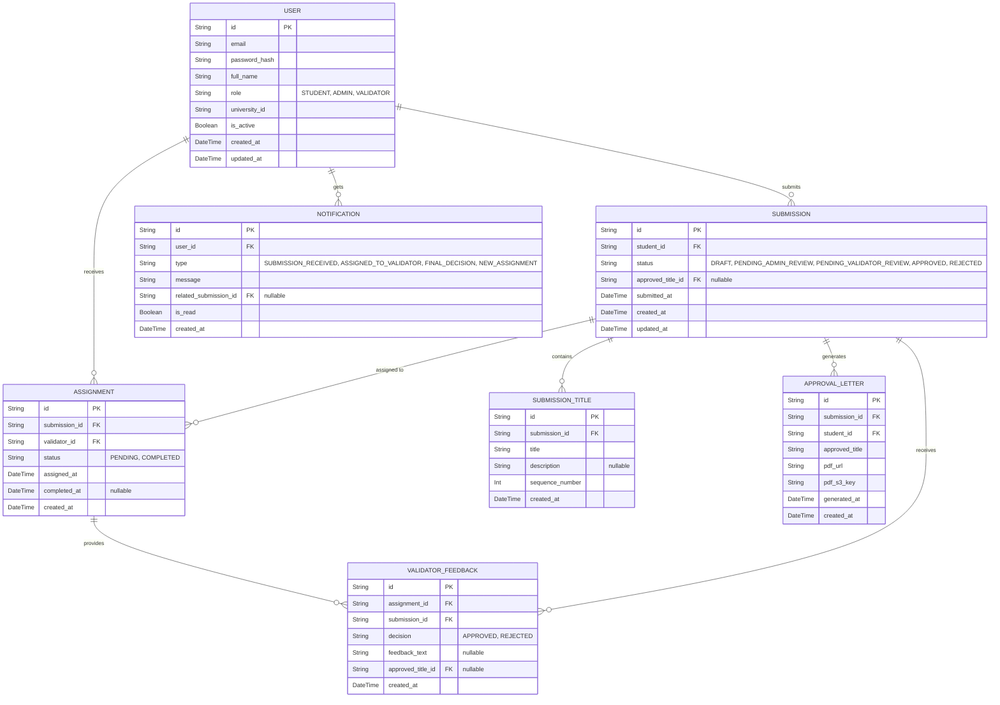

# DATABASE.md: SkripsiHub

## Entity Relationship Diagram



## Table Definitions

### USER
Stores all system users (Students, Admins, Validators). Role-based access control is enforced via the `role` field.

| Column | Type | Constraints | Description |
|:---|:---|:---|:---|
| id | UUID | PK | Unique identifier |
| email | VARCHAR(255) | UK, NOT NULL | University email address |
| password_hash | VARCHAR(255) | NOT NULL | Bcrypt-hashed password |
| full_name | VARCHAR(255) | NOT NULL | User's full name |
| role | ENUM | NOT NULL | One of: STUDENT, ADMIN, VALIDATOR |
| university_id | VARCHAR(50) | UK, NOT NULL | Student/staff ID from university |
| is_active | BOOLEAN | NOT NULL, DEFAULT true | Soft-delete flag |
| created_at | TIMESTAMP | NOT NULL | Record creation time |
| updated_at | TIMESTAMP | NOT NULL | Last update time |

### SUBMISSION
Represents a single thesis title submission by a student. Tracks the entire lifecycle from draft to final decision.

| Column | Type | Constraints | Description |
|:---|:---|:---|:---|
| id | UUID | PK | Unique identifier |
| student_id | UUID | FK (USER.id), NOT NULL | Reference to submitting student |
| status | ENUM | NOT NULL, DEFAULT 'DRAFT' | One of: DRAFT, PENDING_ADMIN_REVIEW, PENDING_VALIDATOR_REVIEW, APPROVED, REJECTED |
| approved_title_id | UUID | FK (SUBMISSION_TITLE.id), nullable | The title selected by validator upon approval |
| submitted_at | TIMESTAMP | nullable | When student formally submitted (moved from DRAFT) |
| created_at | TIMESTAMP | NOT NULL | Record creation time |
| updated_at | TIMESTAMP | NOT NULL | Last update time |

**Business Logic Notes:**
- A student can only have ONE active submission at a time (status not in [APPROVED, REJECTED]).
- Once a submission reaches APPROVED or REJECTED, the student may create a new submission.
- `approved_title_id` is populated only when status = APPROVED.

### SUBMISSION_TITLE
Stores the individual thesis titles within a submission. A submission contains 1–3 titles.

| Column | Type | Constraints | Description |
|:---|:---|:---|:---|
| id | UUID | PK | Unique identifier |
| submission_id | UUID | FK (SUBMISSION.id), NOT NULL | Parent submission |
| title | VARCHAR(500) | NOT NULL | The proposed thesis title |
| description | TEXT | nullable | Optional brief description or rationale |
| sequence_number | INT | NOT NULL | Order within submission (1, 2, or 3) |
| created_at | TIMESTAMP | NOT NULL | Record creation time |

**Business Logic Notes:**
- `sequence_number` ensures a consistent ordering of titles within a submission.
- A submission must have at least 1 and at most 3 titles.

### ASSIGNMENT
Represents the assignment of a submission to a specific Validator for review. Created by Admin when moving submission from PENDING_ADMIN_REVIEW to PENDING_VALIDATOR_REVIEW.

| Column | Type | Constraints | Description |
|:---|:---|:---|:---|
| id | UUID | PK | Unique identifier |
| submission_id | UUID | FK (SUBMISSION.id), NOT NULL | The submission being assigned |
| validator_id | UUID | FK (USER.id), NOT NULL | The validator assigned to review |
| status | ENUM | NOT NULL, DEFAULT 'PENDING' | One of: PENDING, COMPLETED |
| assigned_at | TIMESTAMP | NOT NULL | When the assignment was created |
| completed_at | TIMESTAMP | nullable | When the validator made a decision |
| created_at | TIMESTAMP | NOT NULL | Record creation time |

**Business Logic Notes:**
- One submission may have multiple ASSIGNMENT records if rejected and resubmitted (new assignment to same or different validator).
- `status` transitions from PENDING to COMPLETED when validator provides feedback.

### VALIDATOR_FEEDBACK
Stores the Validator's decision (Approve or Reject) and any associated feedback. Created when a Validator completes their review.

| Column | Type | Constraints | Description |
|:---|:---|:---|:---|
| id | UUID | PK | Unique identifier |
| assignment_id | UUID | FK (ASSIGNMENT.id), NOT NULL | The assignment being completed |
| submission_id | UUID | FK (SUBMISSION.id), NOT NULL | Denormalized for query efficiency |
| decision | ENUM | NOT NULL | One of: APPROVED, REJECTED |
| feedback_text | TEXT | nullable | Rejection reason (mandatory if decision = REJECTED) |
| approved_title_id | UUID | FK (SUBMISSION_TITLE.id), nullable | The selected title if decision = APPROVED |
| created_at | TIMESTAMP | NOT NULL | Record creation time |

**Business Logic Notes:**
- If `decision` = REJECTED, `feedback_text` must be non-empty.
- If `decision` = APPROVED, `approved_title_id` must reference one of the submission's titles.
- This record is immutable once created (no updates).

### APPROVAL_LETTER
Stores metadata and file references for generated approval letters. Created automatically when a submission is approved.

| Column | Type | Constraints | Description |
|:---|:---|:---|:---|
| id | UUID | PK | Unique identifier |
| submission_id | UUID | FK (SUBMISSION.id), NOT NULL, UK | One letter per submission |
| student_id | UUID | FK (USER.id), NOT NULL | Denormalized for query efficiency |
| approved_title | VARCHAR(500) | NOT NULL | The approved thesis title (snapshot) |
| pdf_url | VARCHAR(1024) | NOT NULL | Public/signed URL to download the PDF |
| pdf_s3_key | VARCHAR(1024) | NOT NULL | S3 object key for internal reference |
| generated_at | TIMESTAMP | NOT NULL | When the PDF was generated |
| created_at | TIMESTAMP | NOT NULL | Record creation time |

**Business Logic Notes:**
- One approval letter per submission (unique constraint on `submission_id`).
- `pdf_url` is a signed URL (valid for a limited time) or a public URL depending on S3 bucket policy.
- `pdf_s3_key` enables easy retrieval or regeneration if needed.

### NOTIFICATION
Stores in-app notifications for all users. Tracks read/unread status.

| Column | Type | Constraints | Description |
|:---|:---|:---|:---|
| id | UUID | PK | Unique identifier |
| user_id | UUID | FK (USER.id), NOT NULL | Recipient user |
| type | ENUM | NOT NULL | One of: SUBMISSION_RECEIVED, ASSIGNED_TO_VALIDATOR, FINAL_DECISION, NEW_ASSIGNMENT |
| message | TEXT | NOT NULL | Human-readable notification text |
| related_submission_id | UUID | FK (SUBMISSION.id), nullable | Link to relevant submission |
| is_read | BOOLEAN | NOT NULL, DEFAULT false | Read status |
| created_at | TIMESTAMP | NOT NULL | Record creation time |

**Business Logic Notes:**
- Notifications are created automatically by the system at key workflow transitions.
- Email notifications are sent separately via SendGrid; this table tracks in-app notifications only.
- `is_read` is updated when the user views the notification.

---

## Prisma Schema

```prisma
// prisma/schema.prisma

generator client {
  provider = "prisma-client-js"
}

datasource db {
  provider = "mysql"
  url      = env("DATABASE_URL")
}

model User {
  id            String   @id @default(cuid())
  email         String   @unique
  passwordHash  String   @map("password_hash")
  fullName      String   @map("full_name")
  role          UserRole
  universityId  String   @unique @map("university_id")
  isActive      Boolean  @default(true) @map("is_active")
  createdAt     DateTime @default(now()) @map("created_at")
  updatedAt     DateTime @updatedAt @map("updated_at")

  // Relations
  submissions   Submission[]
  assignments   Assignment[]
  notifications Notification[]

  @@map("user")
}

enum UserRole {
  STUDENT
  ADMIN
  VALIDATOR
}

model Submission {
  id               String   @id @default(cuid())
  studentId        String   @map("student_id")
  status           SubmissionStatus @default(DRAFT)
  approvedTitleId  String?  @map("approved_title_id")
  submittedAt      DateTime? @map("submitted_at")
  createdAt        DateTime @default(now()) @map("created_at")
  updatedAt        DateTime @updatedAt @map("updated_at")

  // Relations
  student          User     @relation(fields: [studentId], references: [id], onDelete: Cascade)
  titles           SubmissionTitle[]
  assignments      Assignment[]
  feedback         ValidatorFeedback[]
  approvalLetter   ApprovalLetter?
  notifications    Notification[]

  @@map("submission")
}

enum SubmissionStatus {
  DRAFT
  PENDING_ADMIN_REVIEW
  PENDING_VALIDATOR_REVIEW
  APPROVED
  REJECTED
}

model SubmissionTitle {
  id               String   @id @default(cuid())
  submissionId     String   @map("submission_id")
  title            String   @db.VarChar(500)
  description      String?  @db.Text
  sequenceNumber   Int      @map("sequence_number")
  createdAt        DateTime @default(now()) @map("created_at")

  // Relations
  submission       Submission @relation(fields: [submissionId], references: [id], onDelete: Cascade)

  @@map("submission_title")
}

model Assignment {
  id               String   @id @default(cuid())
  submissionId     String   @map("submission_id")
  validatorId      String   @map("validator_id")
  status           AssignmentStatus @default(PENDING)
  assignedAt       DateTime @default(now()) @map("assigned_at")
  completedAt      DateTime? @map("completed_at")
  createdAt        DateTime @default(now()) @map("created_at")

  // Relations
  submission       Submission @relation(fields: [submissionId], references: [id], onDelete: Cascade)
  validator        User       @relation(fields: [validatorId], references: [id], onDelete: Restrict)
  feedback         ValidatorFeedback?

  @@map("assignment")
}

enum AssignmentStatus {
  PENDING
  COMPLETED
}

model ValidatorFeedback {
  id               String   @id @default(cuid())
  assignmentId     String   @unique @map("assignment_id")
  submissionId     String   @map("submission_id")
  decision         FeedbackDecision
  feedbackText     String?  @db.Text @map("feedback_text")
  approvedTitleId  String?  @map("approved_title_id")
  createdAt        DateTime @default(now()) @map("created_at")

  // Relations
  assignment       Assignment @relation(fields: [assignmentId], references: [id], onDelete: Cascade)
  submission       Submission @relation(fields: [submissionId], references: [id], onDelete: Cascade)

  @@map("validator_feedback")
}

enum FeedbackDecision {
  APPROVED
  REJECTED
}

model ApprovalLetter {
  id               String   @id @default(cuid())
  submissionId     String   @unique @map("submission_id")
  studentId        String   @map("student_id")
  approvedTitle    String   @db.VarChar(500) @map("approved_title")
  pdfUrl           String   @db.VarChar(1024) @map("pdf_url")
  pdfS3Key         String   @db.VarChar(1024) @map("pdf_s3_key")
  generatedAt      DateTime @map("generated_at")
  createdAt        DateTime @default(now()) @map("created_at")

  // Relations
  submission       Submission @relation(fields: [submissionId], references: [id], onDelete: Cascade)

  @@map("approval_letter")
}

model Notification {
  id                   String   @id @default(cuid())
  userId               String   @map("user_id")
  type                 NotificationType
  message              String   @db.Text
  relatedSubmissionId  String?  @map("related_submission_id")
  isRead               Boolean  @default(false) @map("is_read")
  createdAt            DateTime @default(now()) @map("created_at")

  // Relations
  user                 User     @relation(fields: [userId], references: [id], onDelete: Cascade)
  submission           Submission? @relation(fields: [relatedSubmissionId], references: [id], onDelete: SetNull)

  @@map("notification")
}

enum NotificationType {
  SUBMISSION_RECEIVED
  ASSIGNED_TO_VALIDATOR
  FINAL_DECISION
  NEW_ASSIGNMENT
}
```

---

## Database Indexes & Performance Optimization

### Primary Indexes
The following indexes are automatically created by Prisma for foreign keys and unique constraints. Additional indexes recommended for query performance:

```sql
-- User lookups by email and university_id (already unique)
-- No additional index needed; unique constraints are indexed.

-- Submission queries by student and status
CREATE INDEX idx_submission_student_status ON submission(student_id, status);

-- Assignment queries by validator and status
CREATE INDEX idx_assignment_validator_status ON assignment(validator_id, status);

-- Notification queries by user and read status
CREATE INDEX idx_notification_user_read ON notification(user_id, is_read);

-- Approval letter queries by student
CREATE INDEX idx_approval_letter_student ON approval_letter(student_id);
```

### Query Optimization Notes
- **Active Submission Check:** Query `Submission` filtered by `studentId` and `status NOT IN (APPROVED, REJECTED)` to enforce single-active-submission rule.
- **Validator Queue:** Query `Assignment` filtered by `validatorId` and `status = PENDING` with eager-load of related `Submission` and `SubmissionTitle`.
- **Notification Feed:** Query `Notification` ordered by `createdAt DESC` with pagination; use `is_read` for filtering unread items.

---

## Data Integrity & Business Rules

### Submission Lifecycle Constraints
1. **Single Active Submission per Student:** A student cannot create a new submission while one exists with status in [DRAFT, PENDING_ADMIN_REVIEW, PENDING_VALIDATOR_REVIEW].
2. **Title Count Validation:** A submission must contain between 1 and 3 titles.
3. **Approved Title Selection:** When a submission is approved, `approvedTitleId` must reference one of the submission's own titles.
4. **Immutable Feedback:** Once `ValidatorFeedback` is created, it cannot be updated or deleted.

### Rejection Workflow
- When a submission is rejected, the student receives a notification with feedback.
- The student may then create a new submission (the old one remains in REJECTED status for audit purposes).
- A new `Assignment` is created for the resubmitted submission if the admin assigns it to a validator.

### Approval Letter Generation
- Triggered automatically when `ValidatorFeedback.decision = APPROVED`.
- The letter is generated as a PDF using Puppeteer from an HTML template.
- The PDF is stored in AWS S3, and metadata is recorded in `ApprovalLetter`.
- The student can download the letter via the `pdf_url`.

### Notification Triggers
- **SUBMISSION_RECEIVED:** Created when student moves submission from DRAFT to PENDING_ADMIN_REVIEW.
- **ASSIGNED_TO_VALIDATOR:** Created when admin assigns submission to a validator (sent to validator).
- **FINAL_DECISION:** Created when validator provides feedback (sent to student).
- **NEW_ASSIGNMENT:** Created when a new assignment is created for a validator (sent to validator).

---

## Migration Strategy

### Initial Setup
1. Run Prisma migrations to create all tables and indexes.
2. Seed the database with initial admin and validator accounts (via a seed script).
3. Verify all constraints and indexes are in place.

### Backup & Recovery
- Automated daily backups of the MySQL database to AWS S3.
- Point-in-time recovery enabled for disaster recovery.
- Generated PDFs stored in S3 with versioning enabled.

---

## Security & Compliance

### Data Protection
- All user passwords are hashed using bcrypt (minimum 12 rounds).
- Database connections use TLS 1.2+ encryption.
- Sensitive data (email, university ID) is never logged or exposed in error messages.

### Access Control
- All database queries are parameterized to prevent SQL injection.
- Row-level access control is enforced at the application layer (Nest.js services) based on user role and ownership.
- Validators can only view submissions assigned to them.
- Students can only view their own submissions.

### Audit Trail
- All submissions, assignments, and feedback records include `createdAt` and `updatedAt` timestamps.
- Status changes are immutable; historical records are preserved for audit purposes.
- Notifications provide a user-facing audit log of key events.