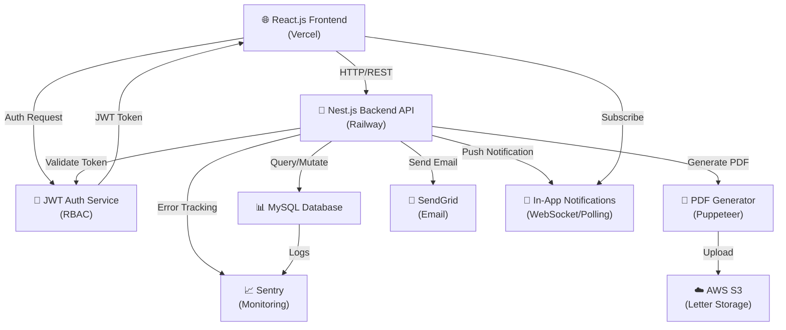
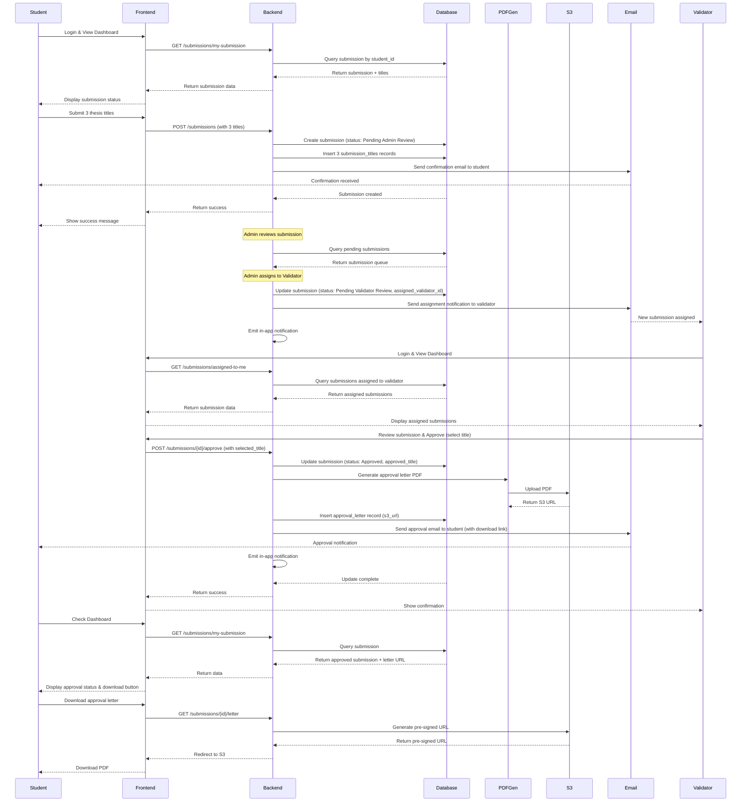

# ARCHITECTURE.md: SkripsiHub

## System Overview

SkripsiHub is built on a three-tier, role-based architecture that enforces a strict submission workflow: Student → Admin → Validator. The frontend is a React.js single-page application (SPA) with role-specific dashboards, communicating via REST APIs to a Nest.js backend. The backend manages all business logic, including submission state transitions, validator assignment, and automated PDF letter generation. MySQL provides relational data integrity for academic records, while AWS S3 stores generated approval letters. JWT-based RBAC ensures that each user can only access and perform actions appropriate to their role. Automated notifications (email via SendGrid and in-app) keep all stakeholders informed at critical workflow milestones.

## High-Level Architecture Diagram

## Component Breakdown

### Frontend (React.js + Tailwind CSS + shadcn/ui)

Responsible for rendering role-specific dashboards and forms. The application is a single-page application (SPA) with three primary views: Student Dashboard, Admin Dashboard, and Validator Dashboard. Each dashboard displays contextual information and actions relevant to the user's role. The Student view includes a submission form (up to 3 titles), status tracker, and letter download. The Admin view shows a queue of pending submissions and assignment controls. The Validator view displays assigned submissions with approval/rejection controls. All UI state is managed via React hooks or a lightweight state management solution. Tailwind CSS provides responsive, utility-first styling, and shadcn/ui supplies accessible, pre-built components (buttons, modals, tables, forms).

### Authentication & Authorization (JWT + RBAC)

A dedicated auth service issues JWT tokens upon successful login. Each token contains role claims (student, admin, validator) and user metadata. The backend validates every incoming request by verifying the JWT signature and extracting role information. RBAC middleware on protected endpoints enforces that only users with the correct role can access specific resources or perform specific actions. For example, only validators can approve/reject submissions; only admins can assign submissions to validators.

### Backend API (Nest.js)

The core business logic layer. Nest.js provides a modular, TypeScript-based architecture organized into feature modules (e.g., SubmissionModule, UserModule, NotificationModule). Key responsibilities include:
- **Submission Management:** Handle student submission creation, state transitions (Pending Admin Review → Pending Validator Review → Approved/Rejected), and enforce business rules (e.g., a student cannot submit a new proposal while one is in review).
- **Validator Assignment:** Allow admins to assign submissions to validators and update submission state accordingly.
- **Letter Generation & Storage:** Trigger PDF generation upon validator approval, store the letter in AWS S3, and associate the S3 URL with the submission record.
- **Notification Orchestration:** Emit events at key workflow milestones (submission received, assigned to validator, final decision) and delegate to the notification service.
- **User Management:** CRUD operations for student, admin, and validator accounts (admin-only).

### Database (MySQL)

Relational schema with the following primary entities:
- **users:** Stores user credentials, role, and profile information (name, email, student ID, etc.).
- **submissions:** Stores submission metadata (student_id, status, created_at, updated_at, assigned_validator_id).
- **submission_titles:** Stores the up-to-3 proposed titles for each submission (submission_id, title_text, order).
- **approval_letters:** Stores metadata for generated letters (submission_id, s3_url, generated_at, approved_title).
- **rejection_feedback:** Stores validator rejection reasons (submission_id, feedback_text, rejected_at).
- **notifications:** Audit log of all notifications sent (user_id, type, status, sent_at).

Foreign keys enforce referential integrity. Indexes on frequently queried columns (e.g., user_id, status, assigned_validator_id) optimize query performance.

### PDF Generator (Puppeteer)

Converts an HTML template (populated with student name, approved title, approval date, and institution details) into a high-fidelity PDF. Puppeteer is invoked asynchronously by the backend when a validator approves a submission. The generated PDF is immediately uploaded to AWS S3, and the S3 URL is stored in the database for later retrieval by the student.

### File Storage (AWS S3)

Stores all generated approval letter PDFs. Each file is named with a unique identifier (e.g., `approval_letter_<submission_id>_<timestamp>.pdf`) to prevent collisions. S3 versioning is enabled for durability. The backend generates a pre-signed URL for the student to download the letter without exposing the raw S3 credentials.

### Email Service (SendGrid)

Sends transactional emails at key workflow events:
- **Student receives:** Submission confirmation, assignment notification, final decision (approved/rejected with feedback link).
- **Validator receives:** New submission assigned for review.
- **Admin receives:** (Optional) Daily digest of pending submissions.

SendGrid is chosen for its reliability, scalability, and ease of integration. Email templates are pre-configured in SendGrid and referenced by template ID in the backend.

### In-App Notifications

Real-time or near-real-time notifications delivered via WebSocket (or polling as a fallback). When a key event occurs (e.g., submission assigned to validator), the backend broadcasts a notification to the relevant user's connected session. The frontend displays a toast or notification badge. This complements email notifications and provides immediate feedback within the application.

### Monitoring & Error Tracking (Sentry)

Captures all unhandled exceptions, API errors, and performance issues in production. Sentry is integrated into both the frontend and backend. Alerts are configured for critical errors (e.g., database connection failures, PDF generation failures). The team receives real-time notifications and can investigate issues via the Sentry dashboard.

## Critical Flow Sequence Diagram

## Deployment Strategy

### Frontend (React.js)

Deployed on **Vercel**. The repository is connected to Vercel via GitHub integration. Every push to the main branch triggers an automatic build and deployment. Environment variables (API endpoint, Sentry DSN) are configured in Vercel's dashboard. The frontend is served globally via Vercel's CDN, ensuring low latency for users worldwide. Preview deployments are automatically generated for pull requests, enabling QA and stakeholder review before merging.

### Backend (Nest.js)

Deployed on **Railway**. The backend service is containerized using Docker. Railway automatically builds the Docker image from the repository, runs migrations on the MySQL database, and deploys the container. Environment variables (database credentials, JWT secret, SendGrid API key, AWS credentials, Sentry DSN) are securely stored in Railway's environment configuration. The backend is auto-scaled based on CPU and memory usage to handle traffic spikes. Health check endpoints (`/health`) are configured to ensure Railway only routes traffic to healthy instances.

### Database (MySQL)

Hosted on **Railway** or a managed service like **AWS RDS**. A dedicated MySQL instance is provisioned with automated daily backups. Connection pooling is configured in the Nest.js backend to efficiently manage database connections under load. Database migrations are run automatically during deployment to ensure schema consistency.

### File Storage (AWS S3)

A dedicated S3 bucket is created for storing approval letter PDFs. Bucket policies restrict access to the backend service (via IAM role) and allow students to download via pre-signed URLs. Versioning is enabled for durability. Lifecycle policies can be configured to archive or delete old letters after a retention period (e.g., 7 years for academic records compliance).

### Monitoring & Logging

**Sentry** is configured for both frontend and backend error tracking. **Railway** provides built-in logs accessible via the dashboard. For advanced logging, an **ELK Stack** (Elasticsearch, Logstash, Kibana) can be deployed on a separate server or cloud provider to aggregate and visualize logs from all services.

### CI/CD Pipeline

GitHub Actions or Railway's native CI/CD is used to automate testing and deployment:
1. **On Pull Request:** Run linting, unit tests, and integration tests. Block merge if tests fail.
2. **On Merge to Main:** Automatically deploy to production (frontend to Vercel, backend to Railway).
3. **Post-Deployment:** Run smoke tests to verify critical endpoints are responding.

### Environment Configuration

Three environments are maintained:
- **Development:** Local machines and a staging database for testing.
- **Staging:** A production-like environment on Railway/Vercel for final QA before production release.
- **Production:** The live environment serving real users.

Each environment has its own database, API keys, and configuration to prevent accidental data corruption or exposure.